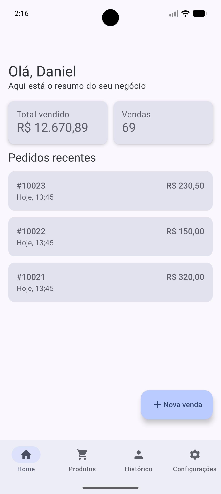
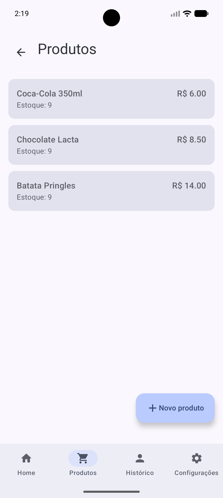
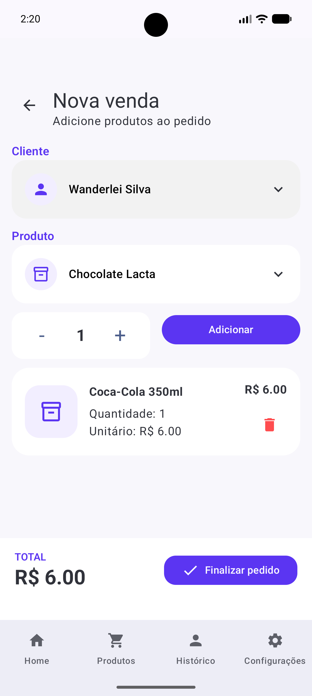
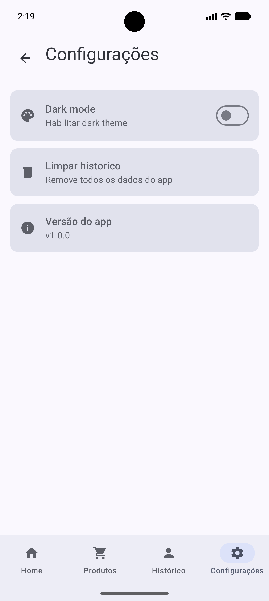

# SalesHub

Aplicativo Android desenvolvido em Kotlin com Jetpack Compose para gerenciamento de vendas, permitindo criar pedidos, visualizar histórico de vendas e consultar produtos de forma simples e intuitiva.

---

## ✨ Features

- 📦 **Cadastro de novas vendas** com persistência local automática.
- 👤 **Seleção de clientes** e controle simplificado de pedidos.
- 🛒 **Adição de múltiplos produtos** ao pedido com relacionamento dinâmico.
- 💰 **Cálculo automático** do valor total dos itens e da venda em tempo real.
- 📄 **Histórico de vendas** reativo atualizado via banco de dados.
- 📶 **Offline First:** Funciona perfeitamente sem internet utilizando persistência local estável.
- 🌙 **Estrutura preparada** para Dark Mode.
- 🎨 **UI moderna** utilizando Material 3 e componentização avançada com Jetpack Compose.

---

## 📱 Telas

<table align="center">
  <tr>
    <td align="center"><strong>Home Screen</strong></td>
    <td align="center"><strong>Produtos</strong></td>
    <td align="center"><strong>Nova Venda</strong></td>
    <td align="center"><strong>Configurações</strong></td>
  </tr>
  <tr>
    <td></td>
    <td></td>
    <td></td>
    <td></td>
  </tr>
</table>
---
## Versão do Android Studio / Ambiente

Android Studio Panda 4 | 2025.3.4 Patch 1
Build #AI-253.32098.37.2534.15336583, built on May 4, 2026
Runtime version: 21.0.10+-14961533-b1163.108 amd64
VM: OpenJDK 64-Bit Server VM by JetBrains s.r.o.
Toolkit: sun.awt.windows.WToolkit
Windows 11.0

---

## 🛠️ Tecnologias e Bibliotecas

- **Kotlin** & **Jetpack Compose** (Construção de UI declarativa e moderna).
- **Material 3** (Componentes visuais e especificações de design do Google).
- **Navigation Compose** (Gerenciamento de rotas, telas e injeção de dependências no escopo de navegação).
- **Jetpack Room Database** (Persistência local SQLite robusta com suporte a Transactions nativas).
- **Kotlin Coroutines & Flow** (Programação assíncrona e fluxo de dados reativo da camada de dados até a UI).
- **KAPT / KSP** (Processamento de anotações para geração de código otimizado).

---

## 🧱 Arquitetura e Estrutura do Projeto

O projeto adota os princípios da arquitetura **MVVM (Model-View-ViewModel)** combinado com o padrão **Repository**, garantindo separação de conceitos, testabilidade e facilidade de manutenção.

```text
com.roque.saleshub/
 ├── data/
 │    ├── local/
 │    │    ├── dao/          # Interfaces de acesso ao Room (SaleDao)
 │    │    ├── database/     # Configuração central do AppDatabase
 │    │    └── entity/       # Tabelas e Relações Relacionais (1-para-Muitos)
 │    └── repository/        # Implementação das regras de dados (SalesRepositoryImpl)
 │
 ├── domain/
 │    └── repository/        # Contratos/Interfaces do Repositório (Desacoplamento)
 │
 ├── presentation/
 │    ├── components/        # Componentes Compose globais e reutilizáveis
 │    ├── navigation/        # Controle de rotas AppNavigation e injeção manual helper
 │    ├── home/              # Tela principal e UI States
 │    ├── products/          # Listagem de produtos
 │    ├── sales/             # Telas de histórico e criação de vendas
 │    └── settings/          # Tela de configurações
 
💎 Destaques da Implementação:
Data Integrity: Uso de database.withTransaction no repositório para garantir a atomicidade das operações — uma venda só é salva se todos os seus itens correspondentes forem gravados com sucesso.

Unidirectional Data Flow (UDF): Estados centralizados nas ViewModels expondo StateFlow seguro para consumo dos composables, evitando vazamentos de estado.

🧪 Qualidade de Código e Testes
O projeto conta com uma suíte de testes automatizados cobrindo diferentes camadas da aplicação:

Testes Unitários (test): Validação da lógica de negócio da SaleViewModel utilizando Mockito para mockar o repositório, garantindo estados iniciais corretos e fluxos de salvamento bem-sucedidos.

Testes de Instrumentação Integrados (androidTest): Validação real da camada do banco de dados Room (SaleDaoTest) rodando em ambiente Android com banco em memória (In-Memory Database), inspecionando a escrita, deleção e a integridade do relacionamento 1-para-Muitos entre Vendas e Itens.

🚀 Como executar o projeto
Clone o repositório utilizando SSH:

Bash
git clone git@github.com:DannielRoque/SalesHub.git
Abra o projeto no Android Studio.

Aguarde o Gradle sincronizar e baixar todas as dependências do projeto.

Execute o aplicativo em um emulador ou dispositivo físico conectado com Android (API 26+ recomendado).

Para rodar a suíte de testes de banco de dados, clique com o botão direito na pasta androidTest e selecione "Run 'All Tests'".

📌 Próximas Melhorias previstas
Integração com API REST / Backend remoto para sincronização em nuvem.

Implementação de Injeção de Dependências robusta utilizando Hilt.

Dashboard avançado com gráficos de faturamento utilizando Jetpack Compose Canvas.

Testes de UI automatizados com Compose UI Test.

👨‍💻 Desenvolvido por

Daniel Roque